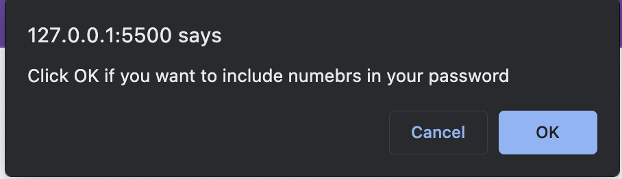

# Password-Generator

## Table of Content
- [Description](#description)
- [Usage](#usage)
- [Visuals](#visuals)
- [Author and Acknowledgement](#author-and-acknowledgement)

## Description 

This website is a randomly password generator website that will generate a password based on the user inputs.

This website will prompt the user for the length of the password and if they want lowercase, uppercase, numbers, or special characters in their password. 

Once the user meets all the requirements, they will be display with a random password based on what the user want to include in their password.

## Usage

How to use this password generator website

1. Step 1: Click on the generate button and it will prompt you to enter a length for your password

2. Step 2: You will be confirm with if you want lowercase letter, uppercase letter, numbers, or special characters in your password. Hit "Ok" to confirm you want those characters. Hit "cancel" to confirm you don't want those characters.

3. Step 3: Once enter the prompt and confirm, the password will display based on your inputs.

## Visuals

This is the home screen of the website when it loads

These are the following prompts and confirms that will be display when user enter the correct criteria

These are the alerts that will be display when the user didn't meet the criteria

;

## Author and Acknowledgement

Starter code by Bootcamp Programmers 

Coded the following functions: promptLength(), promptCharacters(), and generatePassword() by Vanessa Liaw